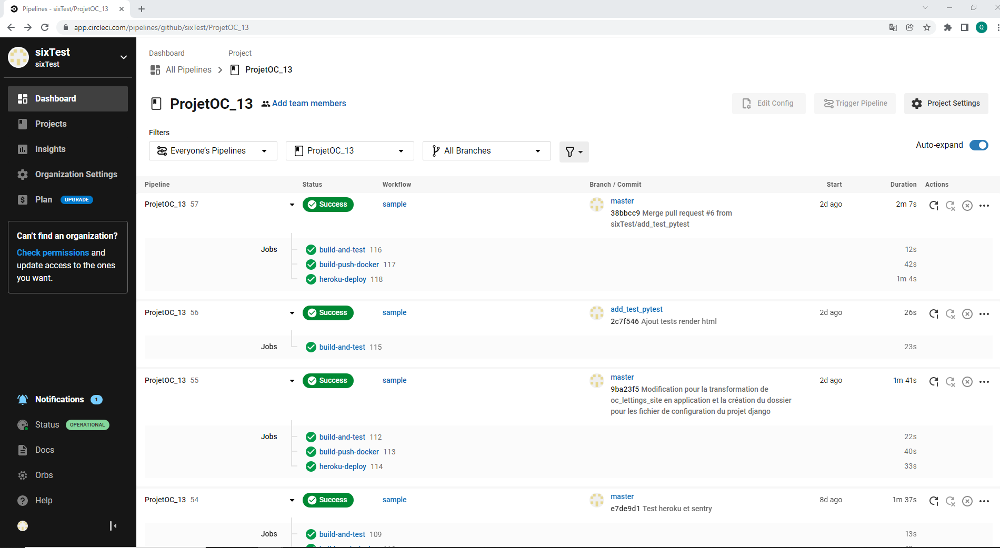
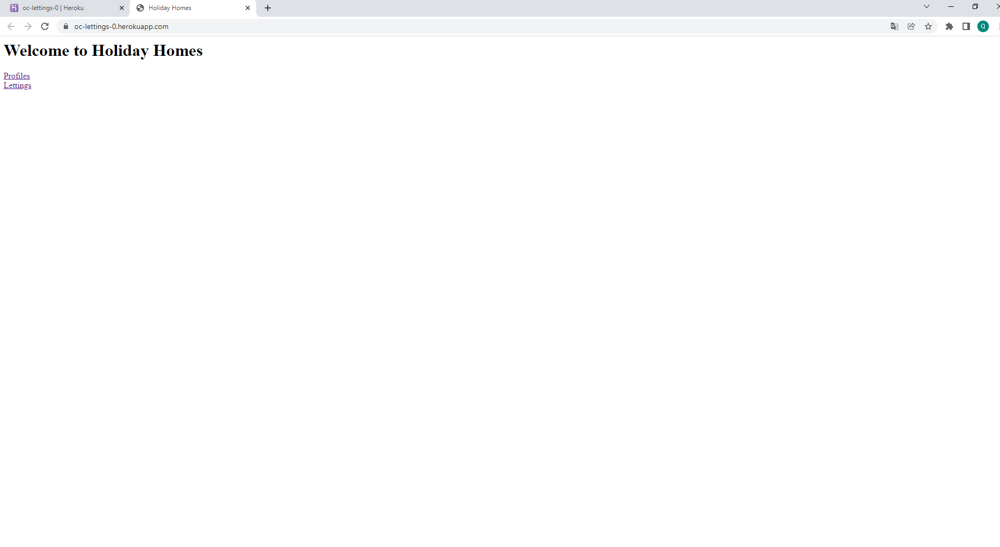
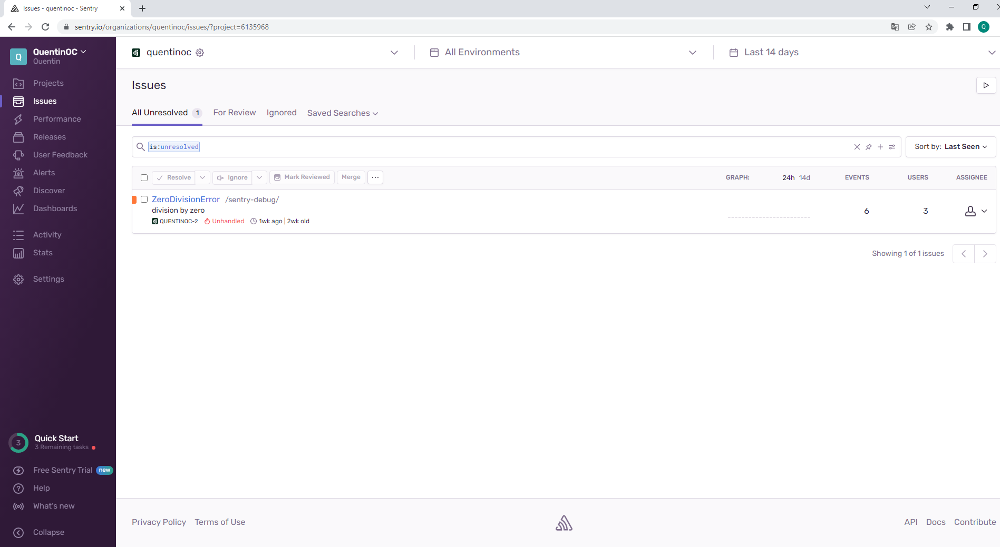

## Description de l'application

Ce projet consiste à mettre a l'échelle une application django OC Lettings en utilisant
une architecture modulaire.

OC Lettings : https://github.com/OpenClassrooms-Student-Center/Python-OC-Lettings-FR

Plusieurs points devaient être améliorés :

- Réduction de diverses dettes techniques sur le projet
    - Erreurs de linting
    - Mauvaise pluralisation de la valeur "adresse" sur le site d'administration
- Refonte de l'architecture modulaire (3 sous applications)
  
    - oc_lettings_site (page d'accueil)
    - lettings
    - profiles
    
- Ajout d'un pipeline CI/CD utilisant CircleCI et Heroku
  
    - (1) un travail de compilation et de tests (sur l'ensemble des branches)
    - (2) un travail de conteneurisation si (1) réussi (uniquement branche master) 
    - (3) un travail de déploiement si (2) réussi
- Surveillance de l’application et suivi des erreurs via Sentry

### Lancement de l'application local

- Récupérez le projet github
- Ouvrez un invite de commande
- Placez-vous dans le répertoire ProjetOC_13
- Création de l'environnement virtuel : ```python -m venv env```
- Activation de l'environnement virtuel :

    - Pour Windows : ```env\Scripts\activate.bat```
    - Pour linux : ```env/bin/activate```
    
- Installation des dépendances : ```pip install -r requirements.txt```
- Lancement du serveur local : ```python manage.py runserver```
- Pour accéder au site : http://127.0.0.1:8000/
- Pour accéder au site d'administration http://127.0.0.1:8000/admin/

     - Login : admin
     - password : Abc1234!
    
### Lancement de l'application via la création d'une image docker

- Installez docker
- Ouvrez un invite de commande  
- Placez-vous dans le répertoire ProjetOC_13
- Construction de l'image : ```docker build -t <nom de l'image> .```
- Lancement de l'image : ```docker run -dp 8000:8000 --env-file envlocal <nom de l'image>```
- Vous pouvez modifier le fichier envlocal si vous souhaité une configuration différente
- Vous pouvez accéder au site de la même manière que précédemment 

### Lancement de l'application via l'utilisation d'une image sur docker hub

- Installez docker et créez un compte docker hub
- Rendez vous sur le repository : https://hub.docker.com/repository/docker/sixtest/projet_oc_13
- Copiez le tag de l'image souhaité
- Ouvrez un invite de commande
- Si vous souhaitez utiliser la configuration par defaut, assurez-vous que votre répertoire courant contienne
le fichier envlocal ou créez-en un si vous souhaitez une configuration différente
- Lancement de l'image : ```docker run -dp 8000:8000 --env-file envlocal sixtest/projet_oc_13:<tag de l'image>```
- Vous pouvez accéder au site de la même manière que précédemment 

### Lancement des tests et du linting

- Localement (invite de commande) ou via la CLI docker
- Pour le linting : ```flake8```
- Pour les tests : ```pytest```

### Lien vers le projet de configuration du pipeline CircleCi

https://app.circleci.com/pipelines/github/sixTest/ProjetOC_13



### Lien vers le déploiement heroku

- Site : https://oc-lettings-0.herokuapp.com/



- Site d'administration : https://oc-lettings-0.herokuapp.com/admin
     - Login : admin
     - password : Abc1234!
  


### Lien vers le projet Sentry

https://sentry.io/organizations/quentinoc/issues/?project=6135968



Exemple issue propagé par heroku sur sentry : https://sentry.io/share/issue/b534680a7f4d49d589801f35d981ea4f/
